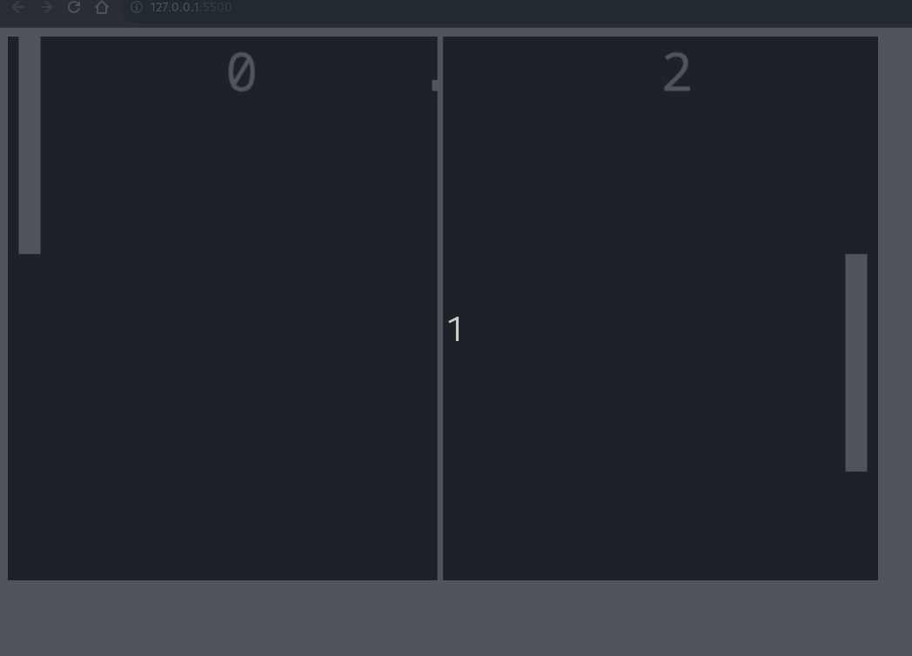

# JOGO DO PONG EM JS
👨‍💻JOGO DO PONG COM HTML, CSS E JS.

## DESCRIÇÃO:
O jogo é uma recriação simples do clássico **Pong**, onde dois jogadores controlam raquetes para rebater uma bola. O objetivo é marcar pontos ao fazer a bola passar pela raquete do adversário. 

- **Dois jogadores**: Cada jogador controla uma raquete vertical, uma do lado esquerdo e outra do lado direito.
- **Controle por teclado**: Um jogador usa as teclas `W` e `S`, enquanto o outro usa as setas `↑` e `↓`.
- **Pontuação**: O jogo exibe a pontuação de cada jogador na tela.
- **Rebote da bola**: A bola rebate nas raquetes e nas bordas superior e inferior do campo.
- **Linha central**: Há uma linha divisória no meio do campo para separar os lados dos jogadores.

## COMANDOS:
<table border="1">
    <thead>
        <tr>
            <th colspan="2">Jogador 1</th>
            <th colspan="2">Jogador 2</th>
        </tr>
    </thead>
    <tbody>
        <tr>
            <td><em><b>Tecla s</b></em></td>
            <td>Tecla para baixar a plataforma</td>
            <td><em><b>seta para baixo</b></em></td>
            <td>Tecla para baixar a plataforma</td>
        </tr>
        <tr>
            <td><em><b>Tecla w</b></em></td>
            <td>Tecla para subir a plataforma</td>
            <td><em><b>seta para cima</b></em></td>
            <td>Tecla para subir a plataforma</td>
        </tr>
    </tbody>
</table>

## NÃO SABE?
- Entendemos que para manipular arquivos em `HTML`, `CSS` e outras linguagens relacionadas, é necessário possuir conhecimento nessas áreas. Para auxiliar nesse aprendizado, oferecemos cursos gratuitos disponíveis:
* [CURSO DE HTML E CSS](https://github.com/VILHALVA/CURSO-DE-HTML-E-CSS)
* [CURSO DE JAVASCRIPT](https://github.com/VILHALVA/CURSO-DE-JAVASCRIPT)
* [CURSO DE CANVAS](https://github.com/VILHALVA/CURSO-DE-CANVAS)
* [CONFIRA MAIS CURSOS](https://github.com/VILHALVA?tab=repositories&q=+topic:CURSO)

## CREDITOS:
- [PROJETO CRIADO PELO "leonardossrocha"](https://github.com/leonardossrocha/jogo-pong)
- [PROJETO EDITADO PELO VILHALVA](https://github.com/VILHALVA)
